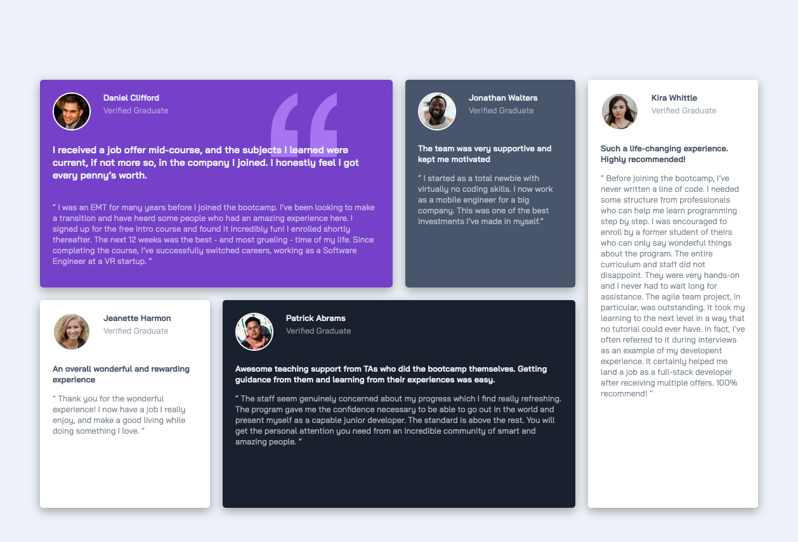
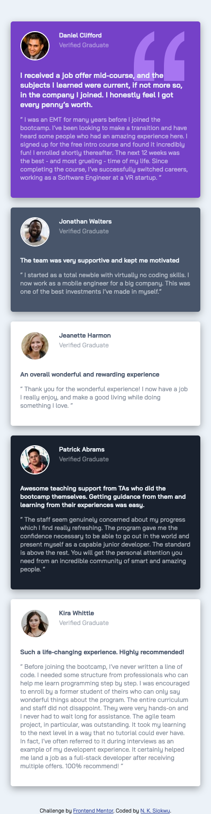

# Testimonials Grid Section

This is a solution to the [Testimonials grid section challenge on Frontend Mentor](https://www.frontendmentor.io/challenges/testimonials-grid-section-Nnw6J7Un7). Frontend Mentor challenges help you improve your coding skills by building realistic projects. 

## Table of contents

- [Overview](#overview)
  - [The challenge](#the-challenge)
  - [Screenshot](#screenshot)
  - [Links](#links)
- [My process](#my-process)
  - [Built with](#built-with)
  - [What I learned](#what-i-learned)
  - [Continued development](#continued-development)
  - [Useful resources](#useful-resources)
- [Author](#author)
- [Acknowledgments](#acknowledgments)


## Overview

### The challenge

Users should be able to:

- View the optimal layout for the site depending on their device's screen size

### Screenshot





### Links

- Solution URL: [View Repository](https://github.com/ladykays/testimonials-grid-section)
- Live Site URL: [View Deployed Site](https://incandescent-chaja-112377.netlify.app)

## My process

### Built with

- Semantic HTML5 markup
- CSS custom properties
- CSS Grid
- Flexbox
- Media queries
- Mobile-first workflow


### What I learned

I had the opportunity to put in practice what I learnt about CSS Grid. It was challenging to get the quotation image to be placed behind the text but I was able to get it to work using the `grid-area` property.
```
  .bg-pattern-quotation {
    grid-area: 1 / 3 / 3 / 4;
  }
```

### Continued development
The area I need to continue working on is: 
* CSS Grid Placement 


### Useful resources

- [Resource 1](https://htmlcolors.com/hsl-to-hex) - This helped convert HSL to HEX format
- [Resource 2](https://yuangela.com/gridgarden/) - This is an amazing site helped me practice working with css grid. I'd recommend it to anyone still learning this concept.
- [Resource 3](https://gist.github.com/lopspower/03fb1cc0ac9f32ef38f4) - This was very useful to get the color codes for transparency.


## Author

- Website - [N. K. Siokwu](https://ladykays.github.io/my-react-portfolio/)
- Frontend Mentor - [@ladykays](https://www.frontendmentor.io/profile/ladykays)
- Linkedin - [N. K. Siokwu](https://www.linkedin.com/in/ndidiamaka-siokwu-67b1a6267/)


## Acknowledgments

I am immensely grateful to the creators of Frontend Mentor for providing me with this valuable opportunity. The challenges they offer have been instrumental in allowing me to apply and enhance the knowledge and skills I have acquired.

